### Quick note

Make sure to have a GitHub account and [Git](https://git-scm.com/) & [GitHub Desktop](https://desktop.github.com/download/) installed before-hand!
(GitHub Desktop isn't mandatory if you're familiar with Git but it makes life a lot easier, I won't be showing how to do it with Git commands).

### Required VSCode extensions

These extensions MUST be installed for everything to work properly and so that you have a smooth development experience.

* [Rojo](https://marketplace.visualstudio.com/items?itemName=evaera.vscode-rojo)
* [Selene](https://marketplace.visualstudio.com/items?itemName=Kampfkarren.selene-vscode)
* [StyLua](https://marketplace.visualstudio.com/items?itemName=JohnnyMorganz.stylua)
* [Lua](https://marketplace.visualstudio.com/items?itemName=sumneko.lua)
* [Luau Language Server](https://marketplace.visualstudio.com/items?itemName=JohnnyMorganz.luau-lsp)

### Recommended VSCode extensions

* [Todo+](https://marketplace.visualstudio.com/items?itemName=fabiospampinato.vscode-todo-plus) (to be able to leave notes like to-do's through code comments and jump to them)
* [Better Comments](https://marketplace.visualstudio.com/items?itemName=aaron-bond.better-comments) (to make certain types of comments a different color)

### Creating the game's repository

First, extract the latest code of the repository to a folder with the same name as your future GitHub repository.

You can get the code for the repository through `Code -> Download ZIP`

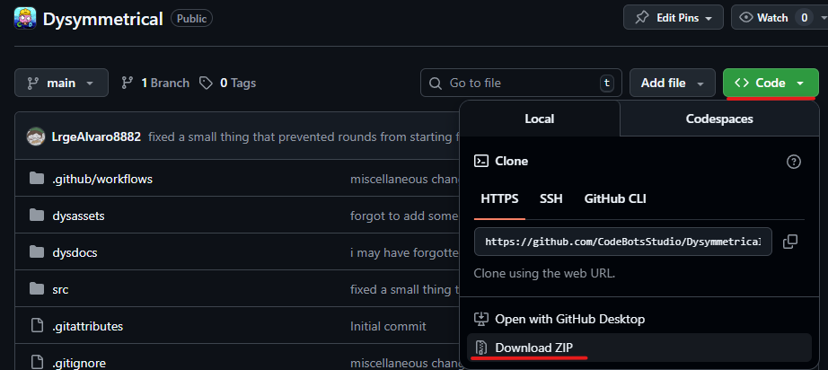

Here's how the final folder should look like:

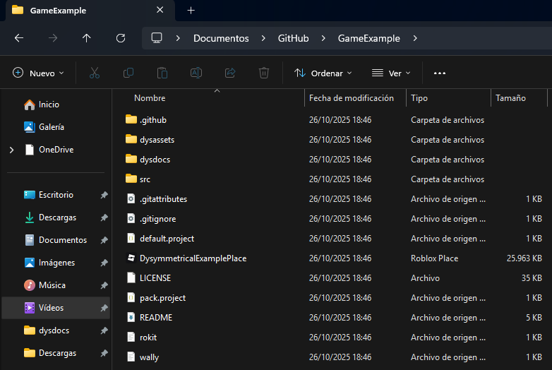

Open GitHub Desktop (read the quick note at the top if you haven't) and create a new repository called the same as the folder you put Dysymmetrical in.
Pick the parent folder when creating the repository so that it creates correctly.

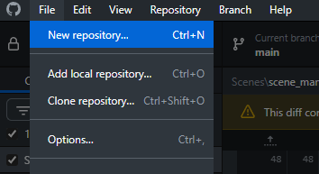

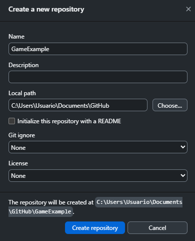

When the repo is created, click `Publish repository` and configure the repo however you want.

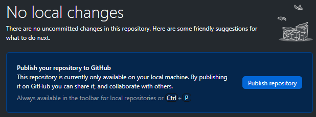

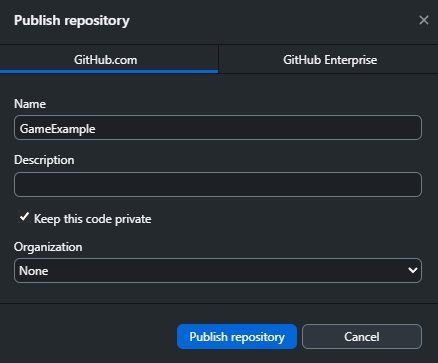

GitHub Desktop won't be needed from now on but it's a good alternative to what I'll explain later.

### Rojo setup

Download [Aftman](https://github.com/LPGhatguy/aftman?tab=readme-ov-file#installation) following their installation tutorial.

After that, install [Wally](https://wally.run/install), a package manager required for this engine to work.

When Wally is installed, restart VSCode and run `wally install` in VSCode's terminal.

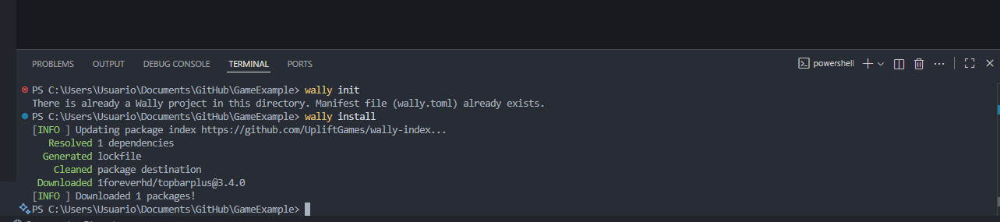

Now that Wally is set up, click the play icon besides the Rojo label at the bottom right.

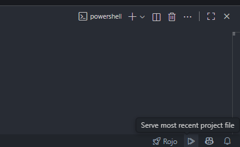

The first time it'll open the Rojo menu at the top.
Install the Roblox Studio plugin through the button in the menu if you haven't yet.

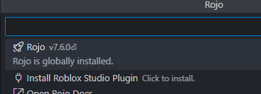

When installed, re-open the menu and click the label with a play icon to turn on the local server (also called "to serve").
Make sure that you use `default.project.json`.

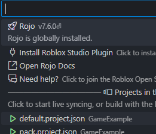

This will make a window pop up at the bottom right saying that the Rojo server is listening (on).

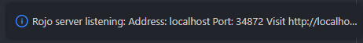

### Rojo basics

I'd recommend enabling `Auto Save` to make it behave the same as Studio's editor.

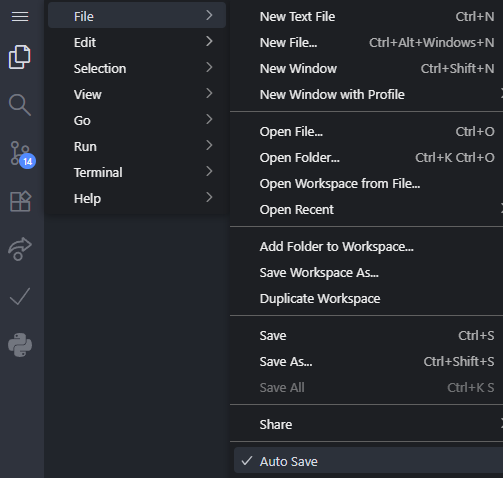

While the Rojo server is listening you can connect it to Studio by opening the plugin window and hitting `Connect`.

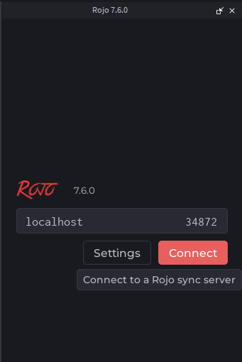

If it says anything other than "Connected to session `PROJECTNAMEHERE`", read the Rojo docs.

Now everything is set up!
Every time that you enter VSCode you'll have to do these steps.

### GitHub basics

To push changes to GitHub so that they save in the version control and so that collaborators can receive them, open `Source Control` in VSCode, name your changes, commit them and sync them.

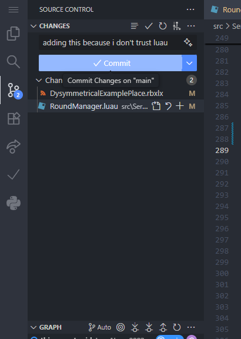
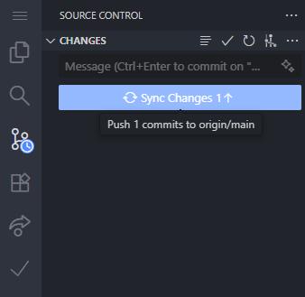

If you haven't done this yet, copy your repository's link and add `.git` at the end.

For example: `https://github.com/CodeBotsStudio/Dysymmetrical.git`.

Then, take that link and execute `git remote add origin [LINK]` in the VSCode terminal, replacing `[LINK]` with the link.

To get changes that you don't have from GitHub, open the VSCode terminal and write `git pull origin main`.

### Updating the engine

If you haven't done this yet, execute `git remote add upstream https://github.com/CodeBotsStudio/Dysymmetrical.git`.

When an update releases, you can execute `git pull upstream main` to get the changes from the engine's repository.

Make sure to read the changelog in `ServerScriptService/DYSYMMETRICAL_CHANGELOG` to see if you have to take anything from the example place (e.g. UI).

If there's any merge conflicts, check out [this page](https://code.visualstudio.com/docs/sourcecontrol/overview#_merge-conflicts).
