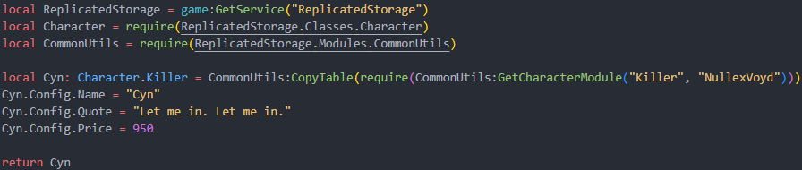

### Quick note

All of the classes are in `ReplicatedStorage/Classes` (e.g. `Character` & `Ability`). This is useful for type checking and for getting the default settings for each class.

It's also important to use `Class:GetDefaultClassSettings()` to make sure that everything necessary is there and that nothing will break (almost) every time the engine is updated.

For assets (that aren't bound to the character's model) used in abilities, define them in `Character.Config` to be able to change them in skin definitions.

### Making the script
Create a new script in `ReplicatedStorage/Characters/Skins/(CHARACTERTYPE)/(CHARACTERNAME)` with the skin's name as the script's name and the character that this skin will be for. Just like the character formatting, the name of the script should be formatted without spaces and preferably case-sensitive.

For example, I have a skin for Nullex called "Cyn" (yes, the Murder Drones character), so the script will be like so: `ReplicatedStorage/Characters/Skins/Nullex Voyd/Cyn.luau`.

The skin's model that'll be applied to the player will go in `ServerStorage/Assets/Characters/(CHARACTERTYPE)/(CHARACTERNAME)` with the same name as the script. If it isn't named the same it won't work.

### Writing the script
Making a skin is a lot simpler than making a character, as the abilities are already defined and only aesthetics have to be changed.

We have to copy the entire table of the root character from `ReplicatedStorage/Characters/(CHARACTERTYPE)` and change variables from the Config.

* We define the skin by copying the root character's table over and replace anything. The price will be for the skin and the quote will show up in the buy notification.
* We simply return the skin table.

You shouldn't change GameplayConfig at all since that would make a skin P2W or P2L. Skins are supposed to be **cosmetic**.

### Extra attributes
If the skin is supposed to be only for developers, add the `Dev` tag to the script in Studio.

If not, if the skin is a milestone, add the `Milestone` tag to the script in Studio.

Any skin that isn't purchasable in the shop should have negative price as the skins in the inventory are ordered by lowest to highest price.
