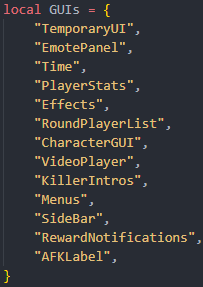

This is the simplest thing to explain in this wiki.

Add a new `ScreenGui` instance to `StarterGui` and configure it however you want EXCEPT for `DisplayOrder`, as that'll be set automatically.

Go to `StarterGui/UIOrdering` in VSCode and add the name of the `ScreenGui` to the `GUIs` table. It's ordered from top (back) to bottom (front).

