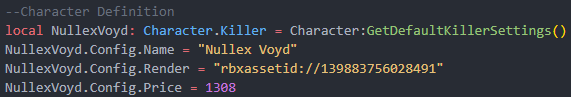
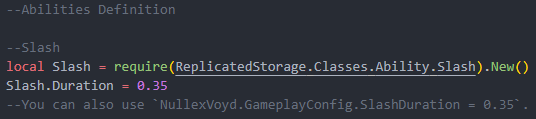
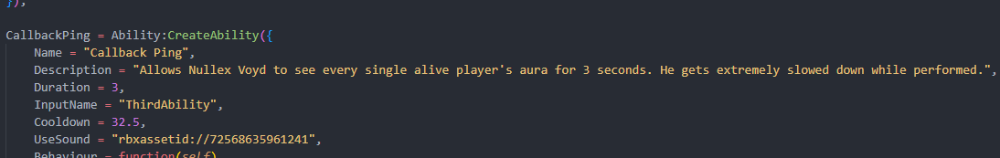
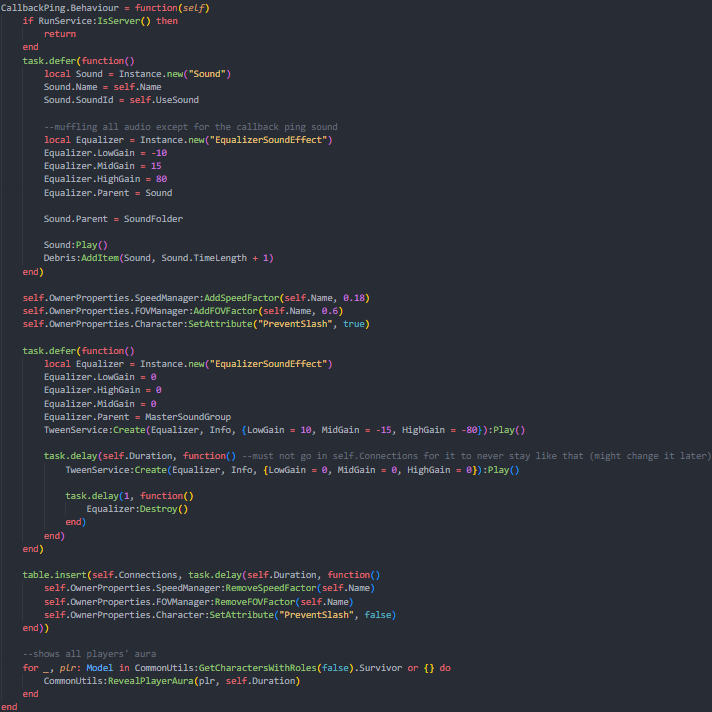
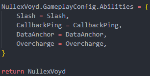

#### Quick note

All of the classes are in `ReplicatedStorage/Classes` (e.g. `Character` & `Ability`). This is useful for type checking and for getting the default settings for each class.

It's also important to use `Class:GetDefaultClassSettings()` to make sure that everything necessary is there and that nothing will break (almost) every time the engine is updated.

For assets (that aren't bound to the character's model) used in abilities, define them in `Character.Config` to be able to change them in skin definitions.

#### Making the script
Create a new script in `ReplicatedStorage/Characters/(CHARACTERTYPE)` with your character's name as the script name. It should be formatted without spaces and preferably case-sensitive.

For example, I have a character called "Nullex Voyd", so the script will be called `NullexVoyd.luau` in Git.

The character's model that'll be applied to the player will go in `ServerStorage/Assets/Characters/(CHARACTERTYPE)` with the same name as the script. If it isn't named the same it won't work.

#### Writing the script
First, we'll define what's the actual character table. Since Nullex Voyd is a killer, I'll do like so:

* Get the default settings for the set role of the character
* Set its `Config` variables (read them in the class for further info)

Now, we'll define every ability.

Starting with the slash:

The slash is the easiest out of them all as it's already pre-written.
`Slash.Duration` is how long the hitbox will linger when enabled.
In the Slash config, you can also set `Slash.Damage`.

After that, you can define any abilities you want. They'll be set in the order that you add them to the final table.
As an example I'll use the "Callback Ping" ability for Nullex:

* I create any constants that don't depend on being unique per player
* I define the ability basing off of the default settings.
    * Take into account that `Ability.InputName` takes the name of one of the ability input keys defined in `StarterPlayer/StarterPlayerScripts/InputManager:Init()`.

After defining the Config, we move on to making the ability's behaviour.

 **QUICK NOTE:** Abilities also have an optional callback called `Ability:ExtraInit()` that only takes `self: Ability.Ability` as an argument just in case you want to create variables or execute code whenever an ability is initialized. 

Instead of doing `Ability.Behaviour = function(self) end` you may also do `function Ability:Behaviour() end` and `self` will still be passed, apart from looking nicer.
`Ability:Behaviour()` is first called by the server when it receives a signal and checks if it's possible to use the ability. Then, it sends a signal to the client to execute the same function. So, the functions should be split between client and server for it to work properly. They may also have common code, though on rare occasions.

We do this with every ability we want the character to have and, at the end, we define the ability table with all the abilities in order. Then, we return the character table for usage outside of the module.

#### Extra attributes
If the character is supposed to be only for developers, add the `Dev` tag to the script in Studio.
