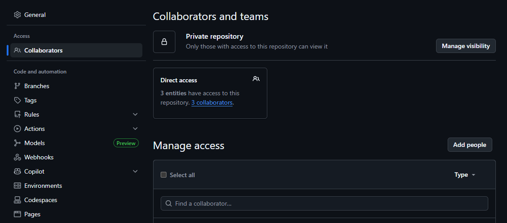
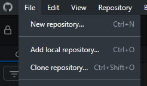

### Quick note

Read [Quick Note](https://github.com/CodeBotsStudio/Dysymmetrical/wiki/0.-Getting-Started#quick-note), [Required VSCode Extensions](https://github.com/CodeBotsStudio/Dysymmetrical/wiki/0.-Getting-Started#required-vscode-extensions) and [Recommended VSCode Extensions](https://github.com/CodeBotsStudio/Dysymmetrical/wiki/0.-Getting-Started#recommended-vscode-extensions) from [0. Getting Started](https://github.com/CodeBotsStudio/Dysymmetrical/wiki/0.-Getting-Started).

### Adding someone to an existing repository (OWNER)

If you want to add someone to your GitHub repository to work on the game, you can do either one of these:
* If the repo is owned by an organization, add them to either the organization or to the repo.
* If not, add them to the repo directly.

Collaborators in a repo can be viewed in `Settings -> Collaborators`.

Add them preferably through their username.

### Working on the project (COLLABORATOR)

When you get added to a repo, clone it through GitHub Desktop.

After this, follow [0. Getting Started](https://github.com/CodeBotsStudio/Dysymmetrical/wiki/0.-Getting-Started#rojo-setup) starting from `Rojo Setup`.
